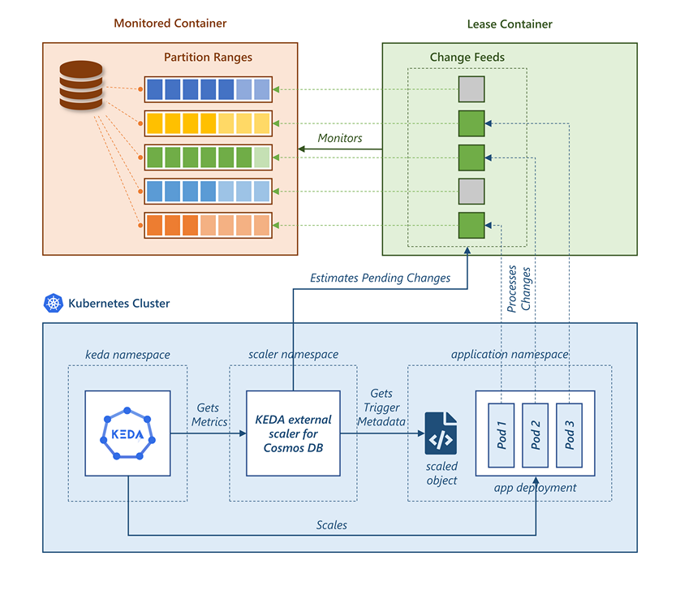

# KEDA External Scaler for Azure Cosmos DB

Scale applications based on changes to [Azure Cosmos DB](https://azure.microsoft.com/services/cosmos-db/) container data.

[](https://github.com/kedacore/keda-external-scaler-azure-cosmos-db/actions?query=workflow%3A"Main+branch+build")

## Architecture

Following diagram shows the different components that are involved for achieving the application scaling, and the relationships between these components.



- **Monitored Container** - The Azure Cosmos DB container that the application needs to monitor for new changes. A Cosmos DB container might contain several logical partitions based on the presence of distinct values of partition keys. Different logical partitions will be grouped under the same **Partition Range** if they are stored on the same physical partition. For more information, please read the documentation on [partitioning overview](https://docs.microsoft.com/azure/cosmos-db/partitioning-overview). In general, for containers that do not contain large amount of data, the count of physical partitions does not exceed 1.

- **Lease Container** - Another Azure Cosmos DB container that keeps track of changes happening on the monitored container. It stores the list of changes in the **Change Feed**. The [change feed design pattern](https://docs.microsoft.com/azure/cosmos-db/sql/change-feed-design-patterns) supports multiple parallel listeners by keeping independent feeds for each partition range. The listener application instances acquire leases on these individual feeds before processing them. This ensures that a change is not processed by multiple applications. You may have both monitored and lease containers in the same Cosmos DB account, but they can also be situated in different  accounts.

- **KEDA** - KEDA runs as a separate service in Kubernetes cluster. It enables auto-scaling of applications based on internal and more primarily, external events. Check [KEDA documentation](https://keda.sh/docs/concepts/) to learn more.

- **External Scaler** - KEDA offers a host of out-of-the-box scalers. It also provides support for [external scalers](https://keda.sh/docs/scalers/external/). In this scheme, KEDA will query an external service to fetch the metric specs and live metrics of an event, and will scale the applications accordingly. This is where 'KEDA external scaler for Azure Cosmos DB' plugs itself in. For information on how an external scaler can be implemented, check [KEDA external scaler concept](https://keda.sh/docs/concepts/external-scalers/).

- **Listener Application(s)** - This represents the application `Deployment` or `StatefulSet` that you would like to scale in and out using KEDA and the external scaler. For information on how to setup the change feed processor in your application that processes changes in Cosmos DB container, read documentation on [change feed processing](https://docs.microsoft.com/azure/cosmos-db/sql/change-feed-processor).

- **`ScaledObject` Spec** - The specification contains information about the scale target (i.e. the application `Deployment` that needs to be scaled) and the trigger metadata. The external scaler fetches information about the Cosmos DB lease container from the trigger metadata defined in the `ScaledObject` resource.

The external scaler calls Cosmos DB APIs to estimate the amount of changes pending to be processed. More specifically, the scaler counts the number of partition ranges that have changes remaining to be processed, and requests KEDA to scale the application to that amount.

> **Note:** The architectural diagram above shows KEDA, external scaler and the target application in different Kubernetes namespaces. This is possible but not necessary. It is a requirement though that the `ScaledObject` and the application `Deployment` reside in the same namespace.

## Setup Instructions

### Deploy KEDA

Follow one of the steps on [Deploying KEDA](https://keda.sh/docs/deploy/) documentation page to deploy KEDA on your Kubernetes cluster.

### Deploy External Scaler

Clone the repository and change to root directory of the cloned repo. Apply the configuration from file `deploy/deploy-scaler.yaml`. It deploys the external scaler `Deployment` resource to the `keda` namespace. It also creates a `Service` resource, that KEDA will send requests to, to fetch the Cosmos DB metrics.

Before applying the configuration, please update the image path in the YAML file if you want to deploy the scaler from a non-`experimental` image. Similarly, you can also update the name and namespace of the external scaler `Deployment` and `Service`.

```text
kubectl apply filename=deploy/deploy.yaml
```

### Deploy Application

Create the `Deployment` or `StatefulSet` resource for your application that would be processing the changes to the Cosmos DB container, and that needs to be scaled with help of KEDA and the external scaler.

### Create `ScaledObject` Resource

Create `ScaledObject` resource that contains the information about your application (the scale target), external scaler, Cosmos DB containers, change feed processor, and other scaling configuration values. Check [`ScaledObject` specification](https://keda.sh/docs/concepts/scaling-deployments/) and [`External` trigger specification](https://keda.sh/docs/scalers/external/) for information on different properties supported for `ScaledObject` and their allowed values.

You can use file `deploy/deploy-scaledobject.yaml` as a template for creating the `ScaledObject`. The trigger metadata properties required to use the external scaler for Cosmos DB are described in [Trigger Specification](#trigger-specification) section below.

> **Note:** If you are having trouble setting up the external scaler or the listener application, the step-by-step instructions for [deploying the sample application](./src/Scaler.Demo/README.md) might help.

## Trigger Specification

The specification below describes the `trigger` metadata in `ScaledObject` resource for using 'KEDA external scaler for Cosmos DB' to scale your application.

```yaml
  triggers:
    - type: external
      metadata:
        scalerAddress: keda-cosmosdb-scaler.keda:4050 # Mandatory. Address of the external scaler service. 
        connection: <connection>                      # Mandatory. Connection string of Cosmos DB account with monitored container.
        databaseId: <database-id>                     # Mandatory. ID of Cosmos DB database containing monitored container.
        containerId: <container-id>                   # Mandatory. ID of monitored container.
        leaseConnection: <lease-connection>           # Mandatory. Connection string of Cosmos DB account with lease container.
        leaseDatabaseId: <lease-database-id>          # Mandatory. ID of Cosmos DB database containing lease container.
        leaseContainerId: <lease-container-id>        # Mandatory. ID of lease container.
        processorName: <processor-name>               # Mandatory. Name of change-feed processor used by listener application.
```

### Parameter List

- **`scalerAddress`** - Address of the external scaler service. This would be in format `<scaler-name>:<scaler-namespace>:<port>`. The port is hardcoded to be `4050` in the external scaler. If you haven't updated the `name` and `namespace` properties in file `deploy/deploy-scaler` when applying the configuration, the metadata value would be `keda-cosmosdb-scaler.keda:4050`.

- **`connection`** - Connection string of the Cosmos DB account that contains the monitored container.

- **`databaseId`** - ID of Cosmos DB database that contains the monitored container.

- **`containerId`** - ID of the monitored container.

- **`leaseConnection`** - Connection string of the Cosmos DB account that contains the lease container. This can be same or different from the value of `connection` metadata.

- **`leaseDatabaseId`** - ID of Cosmos DB database that contains the lease container. This can be same or different from the value of `databaseId` metadata.

- **`leaseContainerId`** - ID of the lease container containing the change feeds.

- **`processorName`** -  Name of change-feed processor used by listener application. For more information on this, you can refer to [Implementing the change feed processor](https://docs.microsoft.com/azure/cosmos-db/sql/change-feed-processor#implementing-the-change-feed-processor) section.

> **Note** Ideally, we would have created `TriggerAuthentication` resource that would have prevented us from adding the connection strings in plain text in the `ScaledObject` trigger metadata. However, this is not possible since at the moment, the triggers of `external` type do not support referencing a `TriggerAuthentication` resource ([link](https://keda.sh/docs/scalers/external/#authentication-parameters)).
